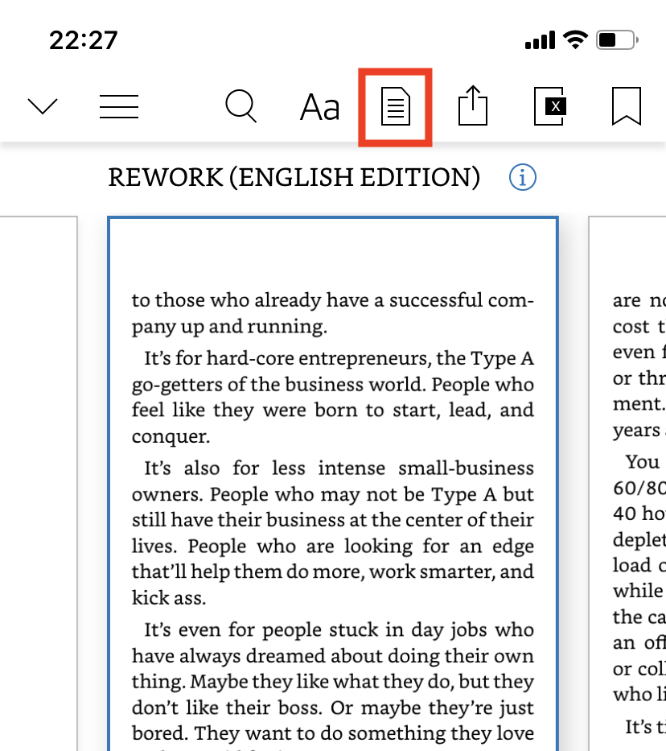
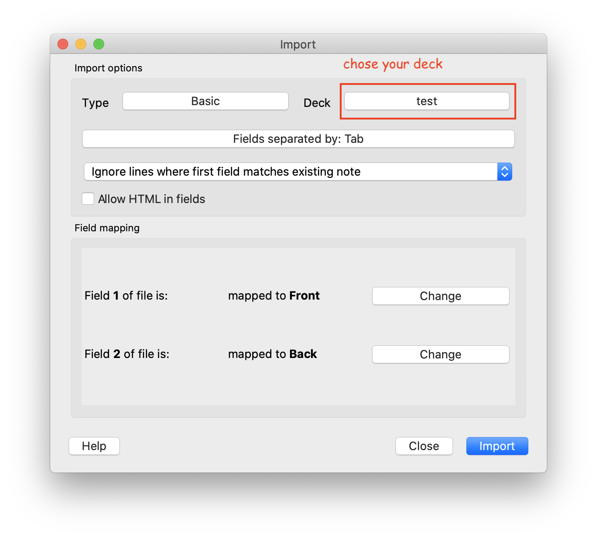

<h1 align="center">Welcome to anki 👋</h1>
<p>
  <a href="#" target="_blank">
    
  </a>
  <a href="#" target="_blank">
    
  </a>
  <a href="https://twitter.com/ThaddeusJiang" target="_blank">
    
  </a>
</p>

> Importing the highlights of book from kindle into Anki

## Getting Started

```sh
mix deps.get

mix escript.build
```

## Usage

1. Exporting highlzight from kindle?

   1. open kindle app(if you didn't install it, install it)
   2. open a book which you want to export
   3. open your word book, and share to your email.
      then you get a html file.

   

2. run `anki`, generate `out.txt`

```sh
$ ./anki file.html
// out.txt
```

3. Importing into anki
   1. open Anki for Mac
   2. open File > Import, and chose `out.txt`
   3. chose your deck and import



## Author

👤 **Jifa Jiang**

- Twitter: [@ThaddeusJiang](https://twitter.com/ThaddeusJiang)
- Github: [@ThaddeusJiang](https://github.com/ThaddeusJiang)

## Show your support

Give a ⭐️ if this project helped you!

---

_This README was generated with ❤️ by [readme-md-generator](https://github.com/kefranabg/readme-md-generator)_
